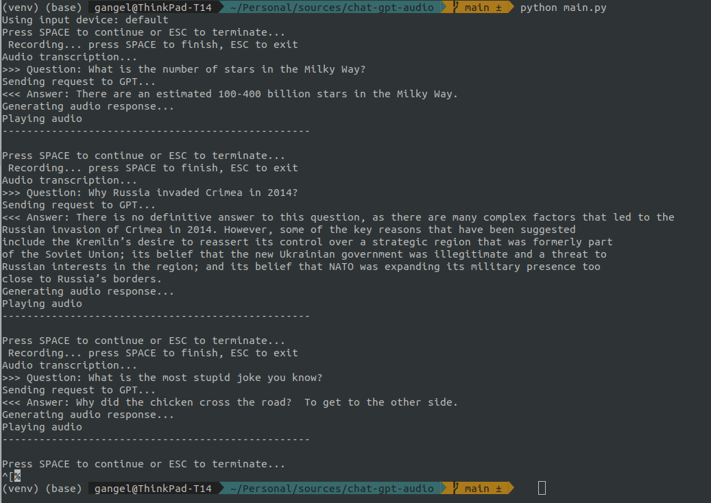

# Chat GPT Audio

### Introduction
The Chat GPT Audio is a Python project that enables users to communicate with OpenAI's GPT-3 natural language processing model through audio input and output. This project is open source and available on GitHub. It uses OpenAI API and audio TTS (text-to-speech) technologies to facilitate the interaction between users and the GPT-3 model.

The most surprising fact about this project is that it was created with the huge support of Chat GPT answers (including a significant part of this README :D. I sent ~35 requests to Chat GPT for help generating different parts of the program, asking for a help to solve some issues I found during development.

### Features
The project offers the following features:

* Audio input and output: Users can speak to the GPT-3 model using a microphone, and the responses from the model are converted into speech using a TTS engine.
* OpenAI API integration: The project uses the OpenAI API to connect to the GPT-3 model and retrieve responses. 
* Transcription of the audio: OpenAI *whisper-1* model
* Text-to-speech used in the project is [Open Text to Speech Server](https://github.com/synesthesiam/opentts)

### Application output


### Installation
To install the project, follow these steps:

1. Clone the project from GitHub to your local machine.
2. Install the required dependencies by running `pip install -r requirements.txt`. 
3. Run Open TTS Server via docker, e.g.
```docker run -it -p 5500:5500 synesthesiam/opentts:en```
4. Configure Open API key in environment variable `OPENAI_API_KEY`

### Usage
* Run the project using the command `python main.py`.
* Default input for microphone is selected.
* Activate recording using SPACE.
* Speak into your microphone and press space to finish.
* Listen to the response from the model through your speakers or headphones.
* Press SPACE to continue or ESC to leave the program.
* Program creates and uses temporary `output.wav` file created in your current directory

### Credits
* Chat GPT :D 